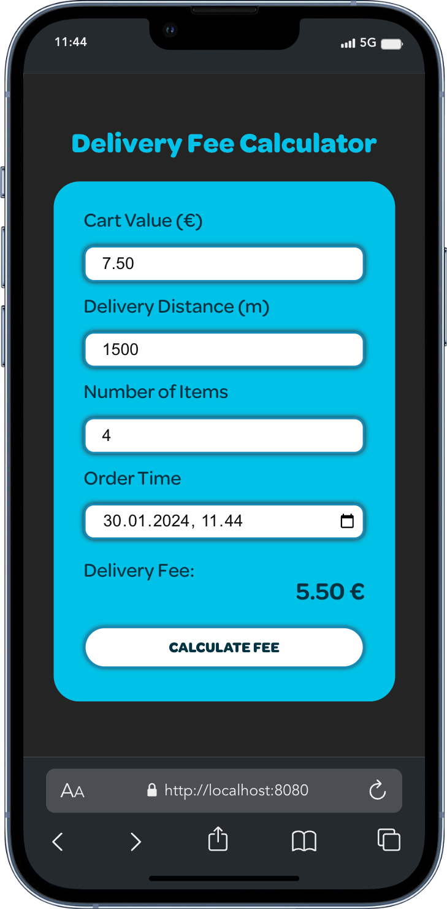

# Delivery Fee Calculator

[](https://github.com/tvntvn13/postgres-demo/actions/workflows/ci.yml)
[](https://sonarcloud.io/summary/new_code?id=tvntvn13_wolt-calculator) 

<a href="https://tvntvn.me" target="_blank"><b>Check out live version!</b></a>
<br>

This project is a pre-assignment for Software Developer Internship at Wolt. The
project is the frontend implementation of the
[requirements](https://github.com/woltapp/engineering-internship-2024?tab=readme-ov-file#delivery-fee-calculator),
made with Typescript and React.

<br>
<div align="center">
    
</div>

## Installation

- clone the repo, go to the directory and install the dependencies:

```bash
git clone git@github.com:tvntvn13/wolt-calculator.git
cd wolt-calculator
npm install
```

- you can build the project and host it with Vite:

```bash
npm run build && npm run preview
```

### Project structure

The project is build with Vite and organised in the following way:

```bash
 src
├──  App.tsx
├──  assets
│   └──  fonts
├──  components
│   ├──  Badge.tsx
│   ├──  FormActionButton.tsx
│   ├──  InputForm.tsx
│   └──  ResultDisplay.tsx
├──  environments
│   └──  environment.ts
├──  interfaces
│   └──  formValue.ts
├──  main.tsx
├──  services
│   ├──  calculateDeliveryFee.ts
│   ├──  formatDateTime.ts
│   └──  parseInputValue.ts
├──  styles
│   ├──  App.css
│   ├──  FormActionButton.css
│   ├──  InputForm.css
│   └──  ResultDisplay.css
└──  tests
    ├──  App.spec.tsx
    ├──  calculateDeliveryFee.spec.ts
    ├──  data
    ├──  FormActionButton.spec.tsx
    ├──  InputForm.spec.tsx
    ├──  parseInputValue.spec.ts
    └──  ResultDisplay.spec.tsx
```

- The entry point for the app is **main.tsx**. It renders the **App** component
- App component manages the state of the app, and passes the state and callback
  functions as props to **InputForm**, **ResultDisplay** and
  **FormActionButton**
- InputForm is responsible for taking and validating the user input
- **calculateDeliveryFee.ts** is the main function of the app, that does all the
  calculations
- Interfaces for the props are contained in the component that uses them, but
  because multiple components use **FormValue**, it has it's own file
- The current values/thresholds for the calculations are all stored in
  **environment.ts** for easy access and modification

#### Accessibility

- The app can be navigated and interacted with using the Tab, Enter and
  Arrow-keys
- All the fields have labels, placeholders, aria-required and aria-describedby
  attributes, combined by visually hidden span elements for screen-readers
- The form can be submitted using the Enter key. If some required fields are
  missing, they will be highlighted and hints will be provided by using the
  browsers built-in functionality
  - Decision to use the browsers built-in systems, instead of writing custom
    implementation, was done to provide a clear and familiar experience to the
    users
- The project is tested for accessibility using axe DevTools browser extension

#### UI/UX

- Main focus was to provide a clear, simple and easy-to-use interface
- The fonts and the colors are chosen to resemble the original branding
- The app is responsive and works on most common devices and screen-sizes
- The input fields don't accept invalid inputs, and there are hints in place if
  required inputs are missing
- The project uses standard css files, grouped in their own styles directory and
  split by the respective component
  - The decision to go with plain css files was made because of the scope of the
    project, and to keep the dependencies minimal and bundle size small

#### Testing

- There are unit and integration tests included in the project
- All the input fields and the calculated delivery fee have a matching
  data-test-id attributes
- The tests are written using Vitest and React Testing Library
- To run the full test suite, run:

```bash
npm run test
```

- To run the full suite and check for code coverage, run:

```bash
npm run test:coverage
```

- To open the results in a browser run:

```bash
open coverage/index.html
```

- To run individual tests, you can run the test command in watch mode and follow
  the instructions on the commandline:

```bash
npm run test:dev
```

#### Code quality

- The project uses ESLint, Stylelint and Prettier to enforce code quality and
  style
- To run the ESLint and Stylelint checks, run:

```bash
npm run lint
```

#### CI/CD

- This project uses GitHub Actions for continuous integration and continuous delivery.
- The CI pipeline is triggered on every pull request and push to the main branch.
- The pipeline includes the following steps:
  - Running a SonarCloud scan to analyze code quality and generate a coverage report.
  - Running linters to ensure code style consistency.
  - Running tests to verify the functionality of the codebase.

#### Dependencies

- To keep the dependencies minimal and the bundle size small, I opted not to use
  any additional libraries
- The only dependencies are React and React-DOM. All other dependencies are for
  development only e.g. linting and testing
- For the scope of the project, I believe working with just the core features of
  React, TS/JS, HTML and CSS helps to demonstrate my understanding of these
  tools
