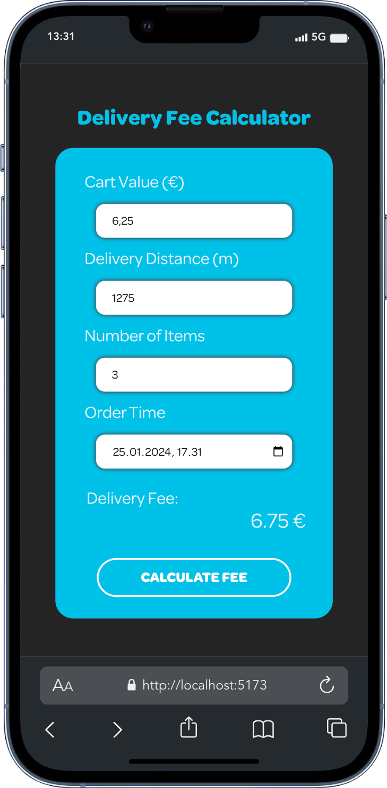

## [LINK TO THE GOOGLE DRIVE](https://drive.google.com/drive/folders/123h34h3CrxZuU6je84Upcfhbi3JHFu0i?usp=sharing)

## Delivery fee Calculator

This project is a pre-assignment for Software Developer Internship at Wolt. The
project is the frontend implementation of the
[requirements](https://github.com/woltapp/engineering-internship-2024?tab=readme-ov-file#delivery-fee-calculator),
done with Typescript and React.

<br>
<div align="center">
    
</div>

#### Installation

- download the archive, extract the files and install dependencies with your
  preferred Node package manager:

```bash
unzip wolt-calculator.zip -d wolt-calculator
cd wolt-calculator
npm install
```

- you can run the dev server with:

```bash
npm run dev
```

- or you can build the project and host it (e.g. with http-server):

```bash
npm run build
cd dist
npm install http-server
http-server -p 8080 -go
```

#### Project structure

Project is organised in the following way:

```bash
 src
├──  App.css
├──  App.tsx
├──  components
│   ├──  FormActionButton.tsx
│   ├──  InputForm.tsx
│   └──  ResultDisplay.tsx
├──  environment
│   └──  environment.ts
├──  fonts
│   ├──  OmnesMedium.woff
│   ├──  OmnesSemiBold.woff
│   ├──  OmnesBold.woff
│   └──  OmnesRegular.woff
├──  index.css
├──  interfaces
│   └──  formValue.ts
├──  main.tsx
├──  services
│   ├──  calculateDeliveryFee.ts
│   └──  formatDateTime.ts
├──  styles
│   ├──  FormActionButton.css
│   ├──  InputForm.css
│   └──  ResultDisplay.css
└──  vite-env.d.ts
```

- The entry point for the app is **main.tsx**. It renders the **App** component
- App component manages the state of the app, and passes the state and callback
  functions as props to **InputForm**, **ResultDisplay** and
  **FormActionButton**
- InputForm is responsible for taking and validating the user input
- **calculateDeliveryFee.ts** is the main function of the app, that does all the
  calculations
- Interfaces for the props are contained in the component that uses them, but
  because multiple components use **FormValue**, it has it's own file
- The current values/thresholds for the calculations are all stored in
  **environment.ts** for easy access and modification

#### Accessibility

- The form can be navigated and interacted with using the Tab, Enter and
  Arrow-keys
- All the fields have labels, placeholders and aria-describedby attributes,
  combined by visually hidden span elements for screen-readers
- The form can be submitted using the Enter key. If some required fields are
  missing, they will be highlighted and hints will be provided by using the
  browsers built-in functionality
  - Decision to use the browsers built-in systems instead of writing custom
    implementation, was done to provide a clear and safe experience that the
    users are already familiar with

#### UI/UX

- Main focus was to provide a clear, simple and easy-to-use interface
- The fonts and the colors are chosen to be as close to the original branding as
  possible
- The app is responsive and works on most common devices and screen-sizes
- The input fields don't accept invalid inputs, and there are hints in place if
  required inputs are missing
- The project uses standard css files, grouped in their own styles directory and
  split by the respective component
  - The decision to go with plain css files was made because of the scope of the
    project, and to keep the dependencies minimal, vs Tailwind, DaisyUI, or any
    CSS-in-JS solution

#### <s>Testing</s>

- <s>There are unit tests as well as integration tests included in the
  project</s>
- <s>All the input fields and the calculated delivery fee have a matching
  data-test-id attributes.</s>
- <s>The tests are using Vitest and React Testing Library</s>
- <s>To run the full test suite, run:</s>

```bash
npm run test
```

:/ testing not implemented yet
